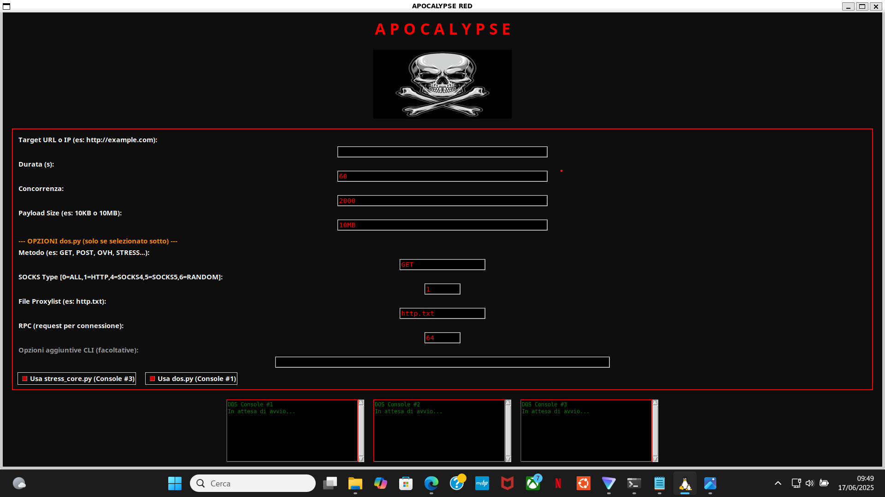

# apocalypse

**Strumento per test di stress/DoS/DDoS con tre console:** due con stresscore, una con dos.py.  
Usa metodi moderni di attacco e gestione proxy.  

ddos-attack-tool
ddos-attack-tools
ddos
dos DDOS DOS

POTETE SCRIVERMI PER PROBLEMI O ERRORI

# APOCALYPSE-DDOS 🔥
QUESTO é IL TOOL ESEGUITO CON LA GUI:


**APOCALYPSE-DDOS** è il tool definitivo per test di stress e simulazione DDoS, con oltre 30+ metodi Layer 4/7: potente, veloce e facile da usare.  
> ⚡️ **Usalo solo per scopi educativi e test autorizzati!** ⚡️

---

## ⭐️ Caratteristiche principali

- **30+ metodi DDoS Layer 4 & Layer 7** (inclusi GET, POST, OVH, STRESS, TCP, UDP, SYN, NTP, DNS, etc)
- **Gestione proxy avanzata** (HTTP, SOCKS4, SOCKS5, random)
- **Bypass cloudflare/antiddos** (CFB, DGB, BOMB, etc)
- **Interfaccia grafica (GUI) facile** con 3 console parallele
- **Configurabile da file o da GUI** (target, thread, proxies e altro)
- **Performance e multithreading** al massimo livello
- **Console Tools**: info, ping, check, dstat, ecc (solo modalità CLI)

---

## 🚀 Installazione

**1. Clona il repository**

BISOGNA PER FORZA INSTALLARE I PACCHETTI DETTI CON: pip, senno potrebbe compromettere la funzione del tool
COME SI USA?=:mettere il sito  NON L'IP, poi mettere la concorrenza da 1000 a 2000 senno compromette la funzione del tool, 
mettere 10kb a richiesta NON ALTRI NUMERI, metodo potete sciegliere voi, pacchetti potete sciegliere voi, 64 per request per connessione. 
COSI SARA CONFIGURATO IL VOSTRO ATTACCO DDOS/DOS
```bash
^^^PRIMA DELL'INSTALLAZIONE VEDERE LE ISTRUZIONI QUA SOPRA^^^
CI STANNO DUE GUI: 1) gui che assomiglia a loic 2) gui di apocalypse
git clone https://github.com/valerio213/apocalypse-ddos.git
cd apocalypse-ddos
pip install aiohttp certifi dnspython numpy pillow requests cloudscraper PyRoxy yarl icmplib impacket psutil
pip install -r requirements.txt
pip install pillow requests
python3 gui_apocalypse.py/ python3 apocalypse_guiloic.py
```

**3. Installa le dipendenze**
```bash
pip install -r requirements.txt
```
Se ti serve la GUI:  
```bash
pip install pillow requests
```
---

---

## 📦 Cosa bisogna installare per dos.py?

- **Python >= 3.8**
- Tutte le librerie in `requirements.txt`  
  (PyRoxy, cloudscraper, requests, Pillow, psutil, yarl, icmplib, impacket, ecc)
- Consigliato:  
  ```
  pip install -r requirements.txt
  pip install pillow requests
  ```
- (Opzionale) [bombardier](https://github.com/codesenberg/bombardier) se vuoi usare il metodo BOMB.

---

---

## ⚠️ Disclaimer

Questo tool è **solo per test legali ed educativi** su infrastrutture di TUA proprietà o con autorizzazione scritta.  
**Non usare per scopi malevoli. L’autore declina ogni responsabilità.**

---

## ⭐️ Dai una stella e condividi!

Se ti piace APOCALYPSE-DDOS, lascia una ⭐️ e condividilo nei tuoi gruppi, social, forum!  
Più siamo, più funzionalità aggiungeremo!

---


